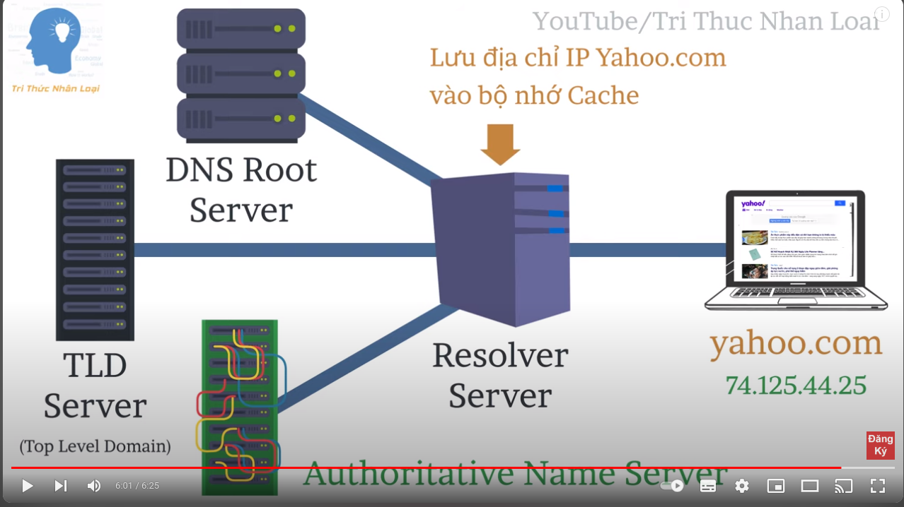

# DNS là gì?

- DNS, viết tắt của “Domain Name System”, là hệ thống quản lý và dịch tên miền (hostname) thành địa chỉ IP để truy cập các trang web trên internet. 

- Nó hoạt động dựa trên cấu trúc phân cấp và liên lạc với các máy chủ DNS để tìm kiếm thông tin về tên miền và địa chỉ IP tương ứng.

- Domain Name System có mục tiêu chính là đơn giản hóa việc truy cập và sử dụng internet bằng cách phân giải tên miền thành địa chỉ IP.

## Chức năng của Domain Name System

- Domain name system cũng giống như một cuốn danh bạ điện thoại. Nghĩa là thay vì phải nhớ hàng tá số điện thoại với một đống con số, thì bạn chỉ cần nhớ tên của chủ nhân số điện thoại thôi. Tương ứng với ví dụ này, số điện thoại sẽ là địa chỉ IP của Website, còn tên chủ nhân chính là tên miền của website đó.

> VD: khi bạn gõ “www.google.com” vào trình duyệt, máy chủ DNS sẽ lấy địa chỉ của máy chủ Google là “74.125.236.37”. Sau đó, bạn sẽ thấy trang home của Google tải trang trên trình duyệt mà bạn đang sử dụng. Đó là quá trình phân giải Domain Name System.

## Cơ chế hoạt động của DNS

Cơ chế hoạt động của DNS (Domain Name System) được thực hiện theo các bước sau:

- Gửi yêu cầu: Khi bạn nhập một tên miền vào trình duyệt web hoặc bất kỳ ứng dụng nào sử dụng mạng, máy tính của bạn gửi một yêu cầu DNS đến máy chủ DNS.
- Caching: Trước tiên, trình duyệt hoặc máy chủ DNS trên máy tính của bạn kiểm tra xem liệu nó đã lưu trữ thông tin cho tên miền này trước đó không. Nếu có, nó sẽ trả về kết quả từ bộ nhớ cache mà không cần phải thực hiện các bước tiếp theo.
- Yêu cầu từ máy chủ gốc (Root DNS Servers): Nếu không có thông tin nào được lưu trữ trong cache, máy tính của bạn sẽ gửi một yêu cầu đến máy chủ DNS gốc. Máy chủ DNS gốc này biết về toàn bộ hệ thống DNS và sẽ hướng dẫn yêu cầu đến máy chủ DNS cụ thể hơn.
- Yêu cầu từ máy chủ Top-Level Domain (TLD): Máy chủ DNS gốc sẽ hướng dẫn yêu cầu đến máy chủ DNS của top-level domain (TLD) tương ứng với tên miền (ví dụ: .com, .org, .net). Máy chủ TLD này biết về các máy chủ DNS của các domain cụ thể.
- Yêu cầu từ máy chủ tên miền cụ thể: Máy chủ DNS của TLD sẽ hướng dẫn yêu cầu đến máy chủ DNS của tên miền cụ thể. Ví dụ, nếu bạn đang truy cập vào "example.com", máy chủ DNS của TLD ".com" sẽ hướng dẫn yêu cầu đến máy chủ DNS của tên miền "example.com".
- Trả về địa chỉ IP: Máy chủ DNS của tên miền cuối cùng sẽ trả về địa chỉ IP tương ứng với tên miền đó cho máy tính của bạn.
- Caching kết quả: Kết quả được trả về sẽ được lưu trữ trong bộ nhớ cache của máy tính để tăng tốc độ truy cập cho các lần truy cập sau.

## Các loại máy chủ DNS sever 

- `Resolver Server` -> (Trung gian): là nhà cùng cấp dịch vụ internet
- `DNS Root Server:` là dịch vụ phân giải tên miền gốc. Tất cả các tên miền trên thế giới đều phải thông qua nó(.com, .org, .vn, .net, ...). 
- `Top-Level-Domain Server:` chịu trách nhiệm quản lý một số lượng lớn các miền cấp cao nhất (TLDs) trong hệ thống DNS. Cụ thể, mỗi TLD server quản lý một hoặc nhiều TLD cụ thể, chẳng hạn như .com, .net, .org, .edu, .gov, .info, vv.
- `Authoritative Name Server:` có trách nhiệm biết mọi thứ về tên miền bao gồm cả địa chỉ ip. chúng là cơ quan cuối cùng

## Các loại truy vấn DNS
- `Truy vấn Recursive:` Máy tính yêu cầu địa chỉ IP hoặc xác nhận rằng máy chủ DNS không biết địa chỉ IP đó.
- `Truy vấn Iterative:` Nếu DNS Server không có địa chỉ IP, nó sẽ trả về Authoritative Name Server hoặc TLD Name Server. Người yêu cầu sẽ tiếp tục quá trình lặp đi lặp lại này cho đến khi tìm thấy câu trả lời hoặc hết thời gian.
- `Truy vấn Non-Recursive:` Trình phân giải DNS sẽ sử dụng truy vấn này để tìm địa chỉ IP mà nó không có trong bộ nhớ Cache. Chúng được giới hạn trong một yêu cầu duy nhất để giới hạn việc sử dụng băng thông mạng.

## Các loại DNS bản ghi DNS phổ biến

Có nhiều loại bản ghi DNS, mỗi loại có mục đích riêng trong việc biểu thị cách xử lý một truy vấn. Các bản ghi DNS phổ biến như sau:

- `A Record (viết tắt là A):` Là Host Record cho IPv4, xác định địa chỉ IP của máy chủ.
- `Quad-A Record (viết tắt là AAAA ):` Đây là Host Record cho IPv6, xác định địa chỉ IP của máy chủ.
- `Alias Record (CName):` Có chức năng chuyển hướng một tên miền sang một tên miền khác.
- `Mail Exchanger Record (MX):` Xác định Host Name cho một Mail Server.
- `Service Location Record (SRV):` Cho phép người dùng tìm một dịch vụ cụ thể.
- `Name Server Record (NS):` Hướng người dùng đến các máy chủ DNS khác.
- `Start Of Authority (SOA):` Chứa dữ liệu trong DNS Zone cung cấp thông tin quản trị về Zone đó và các bản ghi DNS khác.
- `Reverse-lookup Pointer Record (PTR):` Cho phép người dùng tra cứu ngược lại nơi họ cung cấp địa chỉ IP và truy xuất Hostname.
- `Certificate Record (CERT):` Hồ sơ về chứng chỉ và danh sách các chứng chỉ đã bị thu hồi (Certificate Revocation List – CRLs) có liên quan.
- `Text Record (TXT):` Chứa thông tin văn bản có thể đọc được,các thông tin này có thể có giá trị đối với những người khác đang truy cập vào Server.