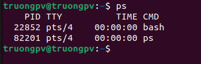
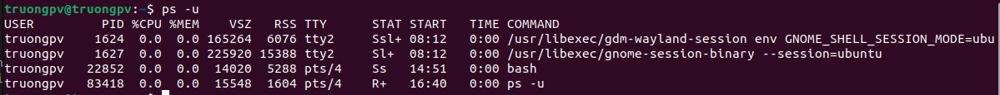
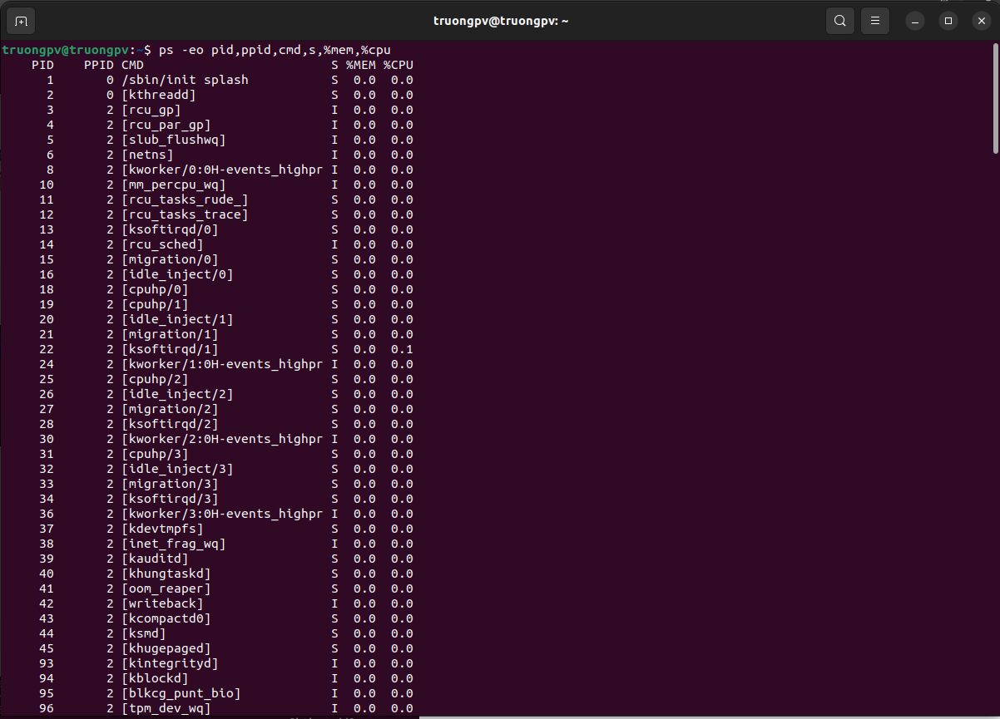
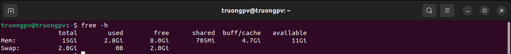
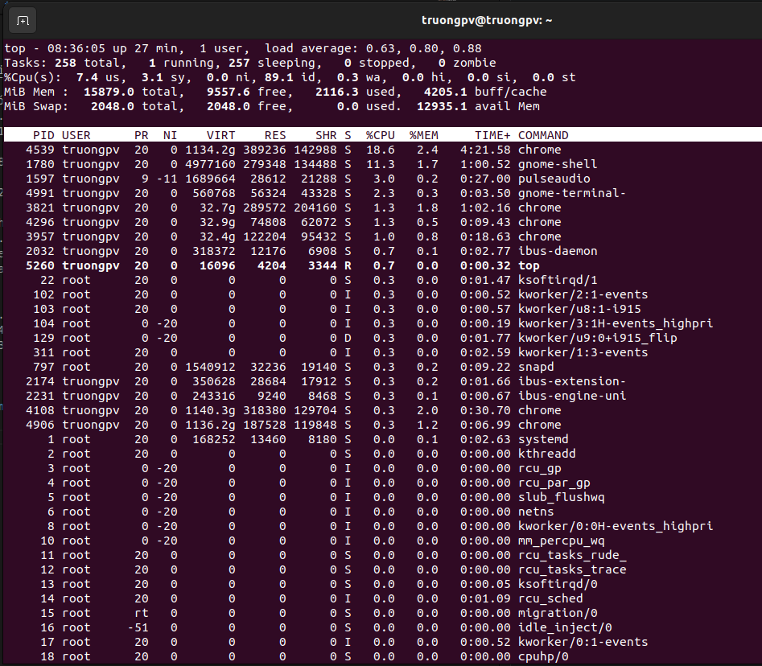
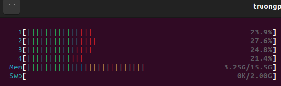
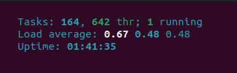

# Manage processes

## Ps là gì?
- `ps` là 1 tiện ích kiểm tra các tiến trình đang chạy trong hệ thống.

## Cách sử dụng

```
ps [option]
```


- Giải thích:
    - PID: ID tiến trình
    - TTY: Thông tin terminal mà người dùng đăng nhập
    - TIME: Thời lượng CPU tính bằng giây phút mà tiến trình đó chạy
    - CMD: Câu lệnh để thực hiện tiến trình đó.

	
- `ps -u` biểu thị các tiến trình đang chạy cho một user cụ thể 



- Lệnh `ps -ef` hiển thị toàn bộ các quy trình trong hệ thống. 
- Lệnh `ps -eLf` đi xa hơn một bước và hiển thị một dòng thông tin cho mỗi luồng (một quy trình có thể chứa nhiều luồng).

`ps -eo pid,ppid,cmd,s,%mem,%cpu`



- Giải thích:
  - CMD: Câu lệnh thực thi tiến trình
  - %CPU: Lượng cpu sử dụng
  - %MEM: Lượng Ram tiêu thụ
  - PID: Mã tiến trình
  - PPID: Mã của tiến trình cha
  - S or STAT: Chứa đoạn mã code mô tả trạng thái của tiến trình

# RAM, CPU

## RAM là gì?
- RAM (Random Access Memory) là một thành phần quan trọng trong hệ thống máy tính, chạy song song với vi xử lý. Đây là bộ nhớ tạm thời giúp lưu trữ thông tin hiện tại để CPU có thể nhanh chóng truy xuất và xử lý.

- Tính chất chính của RAM là không thể giữ lại dữ liệu khi không có nguồn điện cung cấp. Trong trường hợp máy tính mất nguồn hoặc được tắt, dữ liệu trong RAM sẽ bị mất.

## Cách kiểm tra Ram
```
free -h
```



- Mem (Bộ nhớ vật lý):
  - total: 3.8G, tổng dung lượng bộ nhớ vật lý là 3.8 gigabyte.
  - used: 2.1G, lượng bộ nhớ vật lý hiện tại đang được sử dụng là 2.1 gigabyte.
  - free: 128M, lượng bộ nhớ vật lý hiện tại không được sử dụng là 128 megabyte.
  - shared: 299M, lượng bộ nhớ được chia sẻ giữa các tiến trình là 299 megabyte.
  - buff/cache: 1.6G, tổng dung lượng bộ nhớ được sử dụng cho bộ đệm và cache là 1.6 gigabyte.
  - available: 1.2G, lượng bộ nhớ có sẵn để sử dụng cho các tiến trình mới là 1.2 gigabyte.

- Swap (Swap space):
  - total: 2.9G, tổng dung lượng swap space là 2.9 gigabyte.
  - used: 674M, lượng swap space đã được sử dụng là 674 megabyte.
  - free: 2.3G, lượng swap space còn trống là 2.3 gigabyte.

## Cách kiểm tra cpu

**Sử dụng lệnh `top`**



- Giải thích:
  - PID: Số định dạnh cho 1 tiến trình của hệ điều hành (process id)
  - USER: tên user đang chạy process
  - NI (Nice value): Giá trị Nice, ảnh hưởng đến ưu tiên của tiến trình
  - %CPU: tỷ lệ % đag sử dụng cpu của process
  - %MEM: tỷ lệ % đang sử dụng mem của process
  - S: Trạng thái của tiến trình.

**Sử dụng lệnh htop**



- GT: 
  *Mức dùng cpu:*
  - Xanh lam: các tiến trình độ ưu tiên thấp
  - Xanh lục: các tiến trình người dùng (user)
  - Đỏ: các tiến hành hạt nhân (kernel)
  - Vàng: thời gian IRQ
  - Đỏ tươi: thời gian Soft IRQ
  - Xám: thời gian chờ IO

  *Mức dùng bộ nhớ RAM*
  - Xanh lục: bộ nhớ đã dùng
  - Xanh dương: bộ nhớ đệm
  - Vàng: bộ nhớ cache



**Mức tải trung bình**

- Mức tải trung bình được bố trí phái trên bên phải. Systemload hay còn gọi là load, thể hiện số công việc hiện tại hệ thống đang thực thi. Load average cho ta thấy được trung bình khối lượng công việc hệ thống phải xử lý trong mỗi khoảng thời gian 1 phút, 5 phút và 15 phút.

## Kiểm tra cpu và mem xem tiến trình nào chạy nhiều nhất

**CPU**
>top -o %CPU

**MEM**
>top -o %MEM

**Tìm pid của 1 process**
> ps aux

## Load Average là gì?

- Load average là mức độ tải trung bình trên hệ thống trong một khoảng thời gian nhất định. Load average thường được hiểu là số lượng các tiến trình đang chờ được xử lý (bao gồm cả tiến trình đang chạy và tiến trình đang chờ) trên hệ thống.

- Load average thường được biểu diễn dưới dạng ba số nguyên, mỗi số tương ứng với một khoảng thời gian khác nhau:

  - Load average 1 phút: Số tiến trình đang chờ được xử lý trong vòng 1 phút gần đây.
  - Load average 5 phút: Số tiến trình đang chờ được xử lý trong vòng 5 phút gần đây.
  - Load average 15 phút: Số tiến trình đang chờ được xử lý trong vòng 15 phút gần đây.

**Kiểm tra 1 phần mềm có đang chạy trên hệ thống không**

> ps aux | grep chrome

