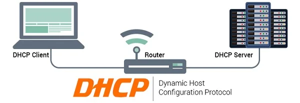

# DHCP là gì?

- DHCP là giao thức mạng, dùng để cấp phát ip tự động.
- Nó giống như 1 nhà phiên dịch giữa thiêt bị yểu cầu với DHCP server

    

## DHCP server là gì?

- DHCP server là 1 thiết bị hoạt động nhu máy chủ, có nhiệm vụ nhận các yêu cầu của DHCP client và cung cấp địa chỉ ip cho chúng.

- Thông thường, DHCP server sẽ gán cho mỗi máy khách một IP động. Nếu địa chỉ IP của máy khách hết hạn thì nó sẽ thay đổi.

## DHCP client là gì?

- DHCP client là máy khách dùng DHCP. Mục đích của DHCP client là thực hiện đăng ký, cập nhật thông tin về địa chỉ IP và những bản ghi DNS của máy khách đó.

`Ví dụ:` Nếu máy khách cần một địa chỉ IP hoặc tham số TCP/IP để thực hiện những giao tiếp trong hệ thống mạng, DHCP client sẽ tự động gửi yêu cầu xin cấp IP đến DHCP server.

## TCP/ID là gì?

- là một bộ các giao thức truyền thông được sử dụng để kết nối các thiết bị mạng với nhau trên internet.

- TCP/IP cũng có thể được sử dụng như một giao thức truyền thông trong mạng máy tính riêng (mạng nội bộ)

- TCP/IP chỉ định cách dữ liệu được trao đổi qua internet.

- TCP/IP được thiết kế để đảm bảo độ tin cậy, nó có khả năng khôi phục tự động khi gặp sự cố trong quá trình truyền dữ liệu.

**TCP và IP là hai giao thức chính bên cạnh những giao thức khác trong bộ**

- Bộ giao thức TCP/IP hoạt động như một lớp trừu tượng giữa các ứng dụng internet và hạ tầng router/switch.

**TCP/IP là sự kết hợp giữa 2 giao thức**
- TCP (Transmission Control Protocol): Là một giao thức truyền dữ liệu đáng tin cậy được sử dụng để thiết lập và duy trì các kết nối giữa các thiết bị trên mạng. TCP đảm bảo rằng dữ liệu được truyền đi một cách an toàn và không bị mất hoặc bị hỏng trên đường truyền.

- IP (Internet Protocol): Là một giao thức địa chỉ dùng để định danh và địa chỉ các thiết bị trong mạng. IP quản lý việc chuyển tiếp dữ liệu giữa các thiết bị trong mạng bằng cách chỉ định địa chỉ IP cho mỗi thiết bị và địa chỉ đích của dữ liệu.

## Subnet Mask là gì?

- Subnet mask là một số 32 bit được tạo bằng cách đặt tất cả các bit host thành 0 và đặt tất cả các bit mạng thành 1. Bằng cách này, subnet mask phân tách địa chỉ IP thành địa chỉ mạng và địa chỉ host.

