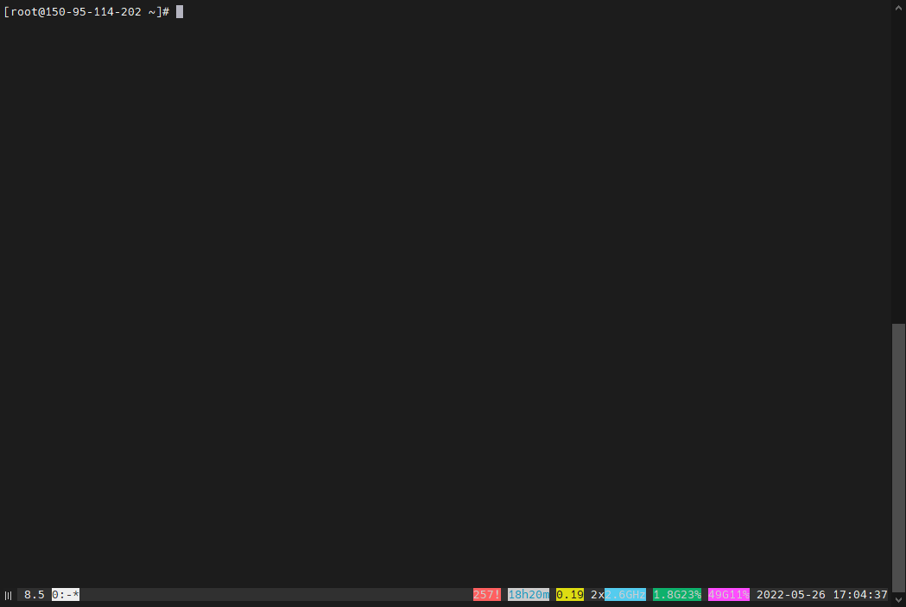

# Hướng dẫn sử dụng byobu:

## Byobu là gì?
- là 1 giao diện hỗ trợ trong terminal. Nó mang đến nhiều hưũ ích như mở được nhiều tab cùng 1 lúc.

## Khi nào cần sử dụng byobu?
- Khi bạn cần phải ssh vào nhiều server, cần tạo nhiều sesion trên server đó.
- `Giả sử:` khi đang dở việc mà phải tắt máy hay sập điện, các phiên SSH bị tắt đi thì sẽ mất hết. Khi đó `byobu` có thể giúp điều đó. Ta có thể truy cập đến server mà ko phải ssh nhiều lần. Khi công việc vẫn đang thực hiện ta phải tắt máy thì byobu vẫn chạy bình thường. Khi ta mở lại thì công việc vẫn được tiếp tục.

**Cách cài byubo:**
```
sudo apt-get install -y byobu
```

**Để vào giao diện byobu, ta gõ trên terminal:**
```
byobu
```

Ta thấy dòng cuối cùng bên phải có các thông tin về các tab đang mở, ngày giờ, CPU, RAM…

**Cách sử dụng byubo trên terminal:

- Phím f1 rồi chọn `help`:


- Phím f2: tạo tab mới 

- Phím f3 và f4: di chuyển qua lại giữa các tab

- Ctrl + f2: chia đôi màn hình theo chiều dọc

- Shift + f2: chia đôi màn hình theo chiều ngang

- Shift + mũi tên trái/phải or Alt + mũi tên trái/phải: để đổi qua lại giữa các màn hình

- gõ exit: đóng cửa sổ  hay tab

- Nếu đang ở tail 1 đoạn log và muốn di chuyển lên để check: nhấn f7 Rồi dùng các phím mũi tên và page up và page down để xem.

- phím f8: đặt tên cho tab