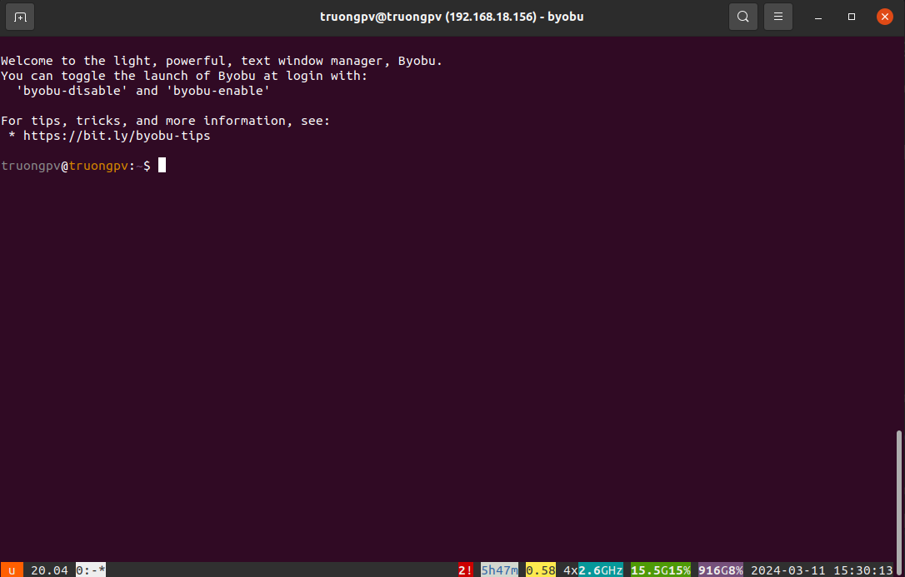
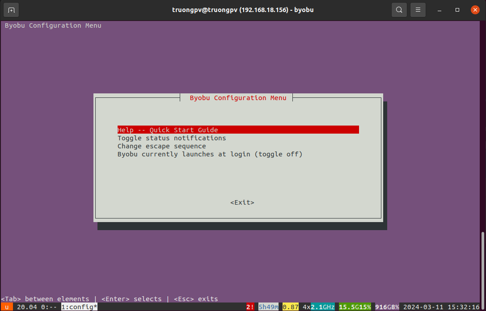
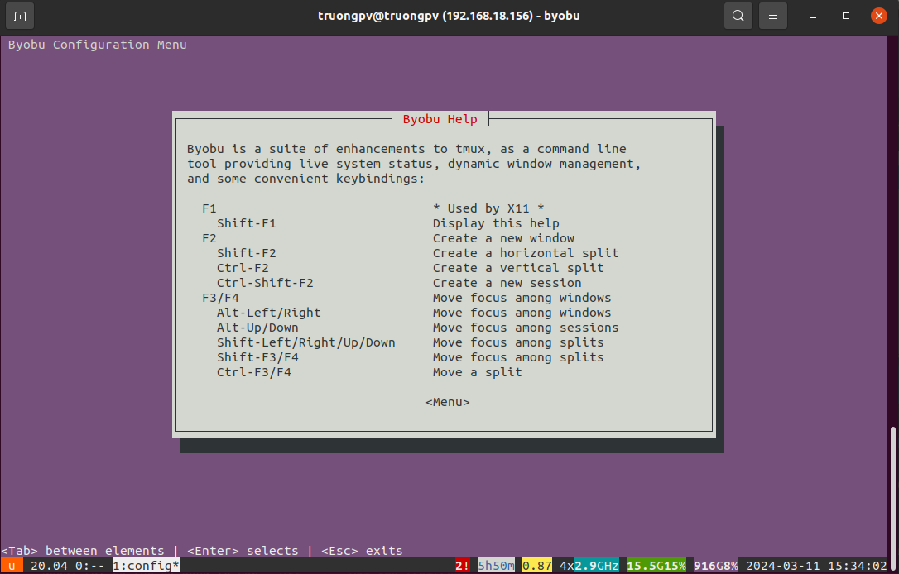
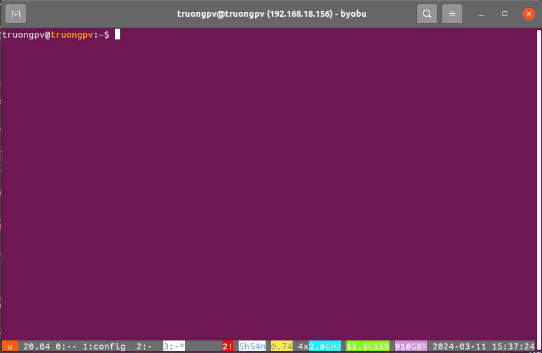
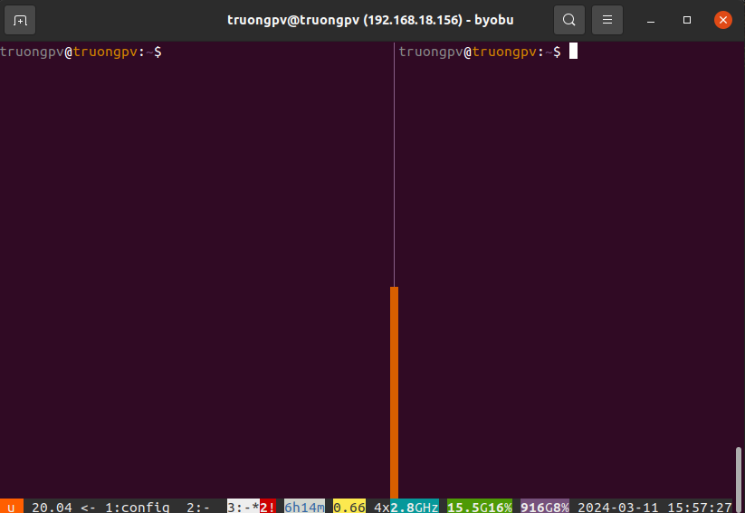
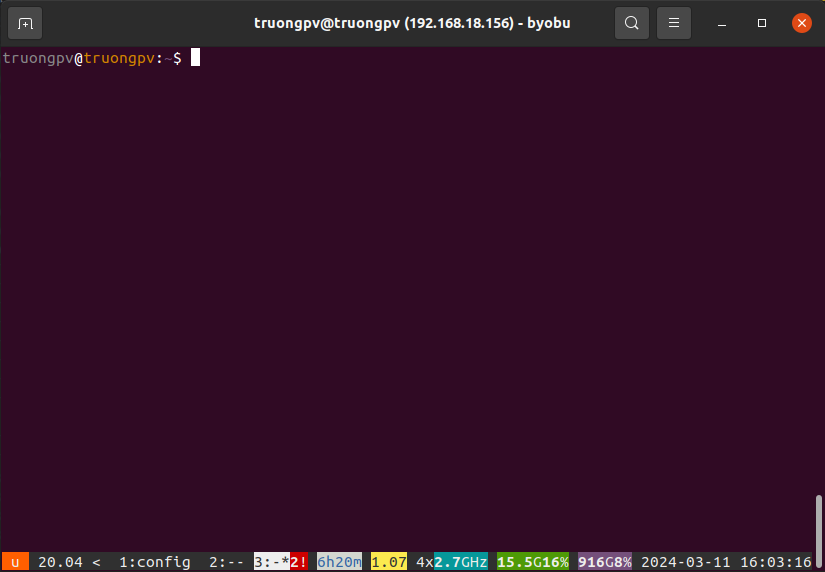
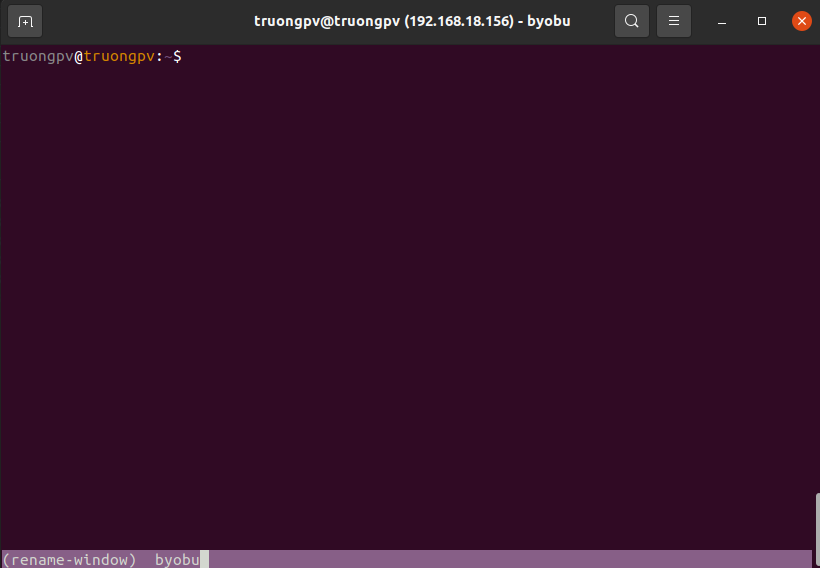

# Hướng dẫn sử dụng Byobu

## 1. Byobu là gì

Byobu là 1 trình hỗ trợ terminal. Nó mang đến nhiều chức năng hữu ích như chia đôi màn hình, mở tab nhanh,...

## 2. Khi nào cần sử dụng Byobu

Khi bạn cần phải ssh vào nhiều server, cần tạo nhiều sesion trên server đó. Tuy nhiên, khi đang dở việc mà phải tắt máy hay sập điện, các phiên SSH bị tắt đi thì coi như hết.

Khi đó, Byobu có thể giúp bạn điều đó. Ta có thể truy cập đến server mà không phải ssh nhiều lần. Khi công việc vẫn đang thực hiện, ta phải tắt máy thì Byobu vẫn chạy. Khi ta mở lại thì công việc vẫn được tiếp tục.

## 3. Cài đặt

### Trên Ubuntu

```
apt-get install -y byobu
```

### Trên CentOS

```
yum install -y byobu
```

## 4. Sử dụng Byobu

Để vào giao diện byobu, ta gõ trên terminal:

**`Byobu`**



Ta thấy có một dòng dưới cùng có các thông tin về các tab đang mở, ngày giờ, CPU, RAM...

Để biết cách sử dụng, ta sẽ bấm phím F1, rồi chọn `Help`



Ta sẽ thấy các phím tắt cùng chức năng của nó



Ở đây, ta sẽ tìm hiểu một số chức năng của nó

### Mở thêm tab mới

Để mở thêm tab mới, ta nhấn phím **F2**

Như ở đây, ta đã tạo thêm 3 tab mới



### Chia đôi màn hình

- Để Chia đôi màn hình theo chiều dọc ta nhấn **Ctrl** + **F2**



- Đổi qua lại giữa các màn hình, ta bấm tổ hợp phím **Shift** + **Mũi tên Trái/Phải**

- Để chia đôi màn hình theo chiều ngang ta nhấn **Shift** + **F2**

### Chuyển đổi qua lại giữa các tab

Để chuyển đổi qua lại giữa các tab, ta sử dụng phím **F3** (sang trái) và **F4** (sang phải)

Ngoài ra, có thể sử dụng tổ hợp **Alt** + **Mũi tên Trái/Phải**



### Đóng một cửa sổ hay tab

Ta gõ lệnh `exit`

### Di chuyển xem log

Bạn đang tail một đoạn log và muốn di chuyển lên để check. Không cần dùng chuột nữa. Chỉ cần nhấn **F7**. Rồi dùng các phím Mũi tên Và **Page UP** + **Page Down** để xem.

### Đổi tên tab

Ta nhấn phím **F8** rồi đặt tên cho tab


