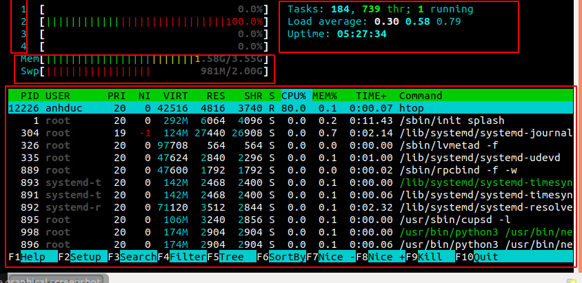
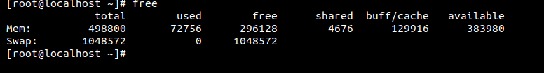

# Tổng quan 

## RAM

1. Khái niệm
`RAM(Random access memory)` hay còn được gọi là `bộ nhớ tạm thời`. Là nơi lưu trữ những thông tin của pc tạm thời và có tốc độ truy xuất cao. 

Một số đặc điểm của RAM : 
- Tốc độ truy xuất cao
- Sẽ bị mất đi khi mất điện 

2. Cách kiểm tra trạng thái của Memorry 
Command `htop` : là một trình xem và quản lý tiến trình của hệ thống. Nó hiển thị một danh sách được cập nhật thường xuyên của các quá trình đang chạy trên máy tính, thường được sắp xếp theo lượng sử dụng CPU



Ô đầu tiên: 
- `1234` : là số core của máy tính và phần trăm hoạt động

Ô thức 2: 
- Tasks        :  Tổng số tiến trình đang chạy       
- thr          :   
- running      : Số user chạy     
- load average : Số CPU load trung bình 
- uptime       : Thời gian máy chạy 

Ô thứ 3 
- Mem :  số lượng RAM chạy trên tổng RAM 
- Swap : lượng swap chạy trên tổng 

Ô thứ 3 giống với command `top`

Command free -m 
Là lệnh dùng để hiển thị dung lượng đã trống và đã sử dụng trong bộ nhớ 



| Option | DESCRIPTION | 
|-------|-----------|
| -b  | Hiển thị kết quả theo byte |
| -k | Hiển thị kết quả theo kilobyte|
| -m | Hiển thị kết quả theo megabyte | 
| -g | Hiển thị kết quả theo gigabyte | 

**File lưu trữ thông tin của ram cat /proc/meminfo**

https://www.tecmint.com/set-linux-process-priority-using-nice-and-renice-commands/

#  Cách kiểm tra trạng thái CPU và RAM trong linux

Lệnh `top`: lệnh trên được sử dụng để `hiển thị các quy trình Linux`. Nó cung cấp một cái nhìn thời gian thực của các tiến trình trong hệ thống đang chạy. 


```
top - 14:16:30 up  3:29,  1 user,  load average: 0,83, 0,90, 1,11
Tasks:  88 total,   1 running,  87 sleeping,   0 stopped,   0 zombie
%Cpu(s):  0,3 us,  0,0 sy,  0,0 ni, 99,7 id,  0,0 wa,  0,0 hi,  0,0 si,  0,0 st
KiB Mem :   498800 total,   176900 free,   121836 used,   200064 buff/cache
KiB Swap:  1048572 total,  1048572 free,        0 used.   346520 avail Mem 

  PID USER      PR  NI    VIRT    RES    SHR S %CPU %MEM     TIME+ COMMAND                 
 3367 root      20   0  161880   2220   1608 R  0,7  0,4   0:00.03 top                     
    1 root      20   0  125424   3776   2568 S  0,0  0,8   0:00.96 systemd                 
    2 root      20   0       0      0      0 S  0,0  0,0   0:00.00 kthreadd                
    3 root      20   0       0      0      0 S  0,0  0,0   0:00.03 ksoftirqd/0             
    4 root      20   0       0      0      0 S  0,0  0,0   0:00.50 kworker/0:0             
    5 root       0 -20       0      0      0 S  0,0  0,0   0:00.00 kworker/0:0H            
    7 root      rt   0       0      0      0 S  0,0  0,0   0:00.00 migration/0             
    8 root      20   0       0      0      0 S  0,0  0,0   0:00.00 rcu_bh                  
    9 root      20   0       0      0      0 S  0,0  0,0   0:00.17 rcu_sched               
   10 root       0 -20       0      0      0 S  0,0  0,0   0:00.00 lru-add-drain           
   11 root      rt   0       0      0      0 S  0,0  0,0   0:00.00 watchdog/0              
   13 root      20   0       0      0      0 S  0,0  0,0   0:00.00 kdevtmpfs               
   14 root       0 -20       0      0      0 S  0,0  0,0   0:00.00 netns                   
   15 root      20   0       0      0      0 S  0,0  0,0   0:00.00 khungtaskd              
   16 root       0 -20       0      0      0 S  0,0  0,0   0:00.00 writeback 
```

Trong bảng ta có các thông số sau: 
- PID : mã tiến trình mỗi tiến trình có một mã riêng để phân biệt với các mã khác
- User: là user đang thực hiện tiến trình đó
- PR : Mức độ ưu tiên của tiến trình được nhìn thấy bởi kernel
```
- NI :  Mức độ ưu tiên của tiến trình là một khái niệm ở không gian người dùng
```
- VIRT : Lượng RAM ảo mà tiến trình chiếm 
- RES : lượng RAM dùng cho tiến trình 
- s : cho biết trạng thái của quá trình
- SHR : 
```
- %CPU : Phần trăm CPU đã dùng cho tiến trình
- %MEM : phần trăm RAM đã dùng cho tiến trình
- TIME+ : Thời gian CPU hoàn thành tiến trình 
```
- COMMAND : Dòng lệnh để thực hiện tiến trình 


