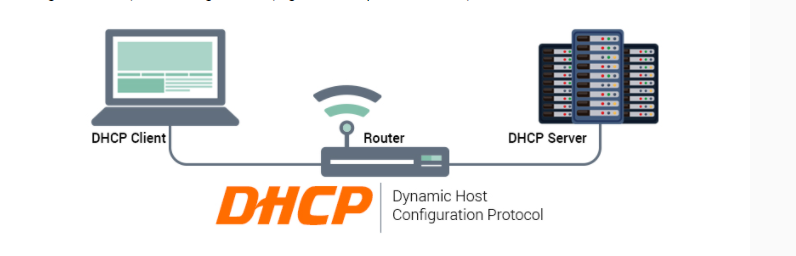
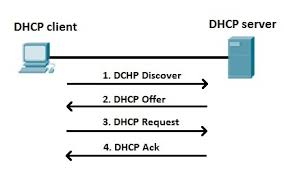

# DHCP

- `DHCP` viết tắt của Dynamic Host Configuration Protocol, là giao thức `tự động cấp phát địa chỉ IP đến các thiết bị trong mạng.` Các địa chỉ IP được cung cấp từ giao thức DHCP sẽ cho phép chúng ta truy cập vào internet. Ngoài ra nó cũng đảm bảo không có trường hợp hai hoặc nhiều thiết bị có cùng IP và còn cung cấp các thông tin cấu hình như DNS, subnet mask, default gateway.

## 1.6 Giao thức

Giao thức DHCP (Dynamic Host Configuration Protocol) là một giao thức mạng được sử dụng để cấp phát địa chỉ IP và các thông số mạng khác tự động cho các thiết bị trong một mạng. Dưới đây là cơ chế hoạt động cơ bản của giao thức DHCP và máy chủ DHCP:

## Cách thức hoạt động của DHCP:

- Được giải thích một cách ngắn gọn nhất về cách thức hoạt động của DHCP chính là khi một thiết bị yêu cầu địa chỉ IP từ một router thì ngay sau đó router sẽ gán một địa chỉ IP khả dụng cho phép thiết bị đó có thể giao tiếp trên mạng.

- Như ở các hộ gia đình hay các doanh nghiệp nhỏ thì router sẽ hoạt động như một máy chủ DHCP nhưng ở các mạng lớn hơn thì DHCP như một máy chỉ ở vai trò là máy tính.

- Cách thức hoạt động của DHCP còn được giải thích ở một cách khác thì khi một thiết bị muốn kết nối với mạng thì nó sẽ gửi một yêu cầu tới máy chủ, yêu cầu này gọi là DHCP DISCOVER. Sau khi yêu cầu này đến máy chủ DHCP thì ngay tại đó máy chủ sẽ tìm một địa chỉ IP có thể sử dụng trên thiết bị đó tồi cung cấp cho thiết bị địa chỉ cùng với gói DHCPOFFER

Khi nhận được IP thì thiết bị tiếp tục phản hồi lại máy chủ DHCP gói mang tên DHCPREQUEST. Lúc này là lúc chấp nhận yêu cầu thì máy chủ sẽ gửi tin báo nhận (ACK) để xác định thiết bị đó đã có IP, đồng thời xác định rõ thời gian sử dụng IP vừa cấp đến khi có địa chỉ IP mới.

## Cơ chế hoạt động của DHCP:

Cơ chế hoạt động của giao thức DHCP (Dynamic Host Configuration Protocol) dựa trên quy trình giao tiếp giữa các thiết bị và máy chủ DHCP. Dưới đây là cơ chế hoạt động cơ bản của giao thức DHCP:

1. **Yêu cầu IP (DHCP Discover)**:
   - Khi một thiết bị mới kết nối vào mạng, nó gửi một gói tin yêu cầu địa chỉ IP tới mạng thông qua giao thức DHCP. Gói tin này được gọi là "DHCP Discover".

2. **Phản hồi cấp phát IP (DHCP Offer)**:
   - Máy chủ DHCP nhận được gói tin yêu cầu từ thiết bị và phản hồi bằng một gói tin chứa địa chỉ IP cung cấp được và các thông tin mạng khác như subnet mask, gateway, DNS server, v.v. Gói tin này được gọi là "DHCP Offer".

3. **Yêu cầu xác nhận IP (DHCP Request)**:
   - Thiết bị nhận được gói tin DHCP Offer từ máy chủ DHCP và chọn một địa chỉ IP từ danh sách được cung cấp. Sau đó, nó gửi một gói tin yêu cầu xác nhận địa chỉ IP được chọn tới máy chủ DHCP. Gói tin này được gọi là "DHCP Request".

4. **Xác nhận IP và cấu hình mạng (DHCP Acknowledgement)**:
   - Máy chủ DHCP nhận được gói tin yêu cầu từ thiết bị và xác nhận rằng địa chỉ IP đã được cấp phát và cấu hình mạng khác đều hợp lệ. Sau đó, nó gửi một gói tin xác nhận (DHCP Acknowledgement) cho thiết bị, xác định rằng quá trình cấp phát IP đã hoàn tất.

Trong quá trình này, máy chủ DHCP chịu trách nhiệm quản lý và cấp phát các địa chỉ IP cho các thiết bị mới kết nối vào mạng. Cơ chế này giúp tự động hóa việc cấu hình mạng và giảm bớt công việc quản trị mạng cho các hệ thống lớn.

## Cơ chế hoạt động của máy chủ DHCP:

1. **Lắng nghe yêu cầu DHCP**: Máy chủ DHCP liên tục lắng nghe trên mạng để nhận các yêu cầu DHCP từ các thiết bị mới kết nối.

2. **Phản hồi yêu cầu DHCP**: Khi nhận được một yêu cầu DHCP từ một thiết bị, máy chủ DHCP phản hồi bằng cách cung cấp một địa chỉ IP và các thông tin mạng khác cho thiết bị đó.

3. **Quản lý cấp phát IP**: Máy chủ DHCP duy trì một danh sách các địa chỉ IP có sẵn trong mạng và kiểm tra xem địa chỉ IP nào có thể được cấp phát cho các thiết bị mới kết nối.

4. **Cấu hình tùy chỉnh**: Máy chủ DHCP có thể được cấu hình để cung cấp các thông tin mạng khác nhau như gateway, subnet mask, DNS server, thời gian thuê địa chỉ IP, v.v. cho các thiết bị trong mạng.

5. **Ghi nhận và theo dõi**: Máy chủ DHCP ghi nhận các hoạt động cấp phát IP và theo dõi việc sử dụng địa chỉ IP trong mạng, giúp quản trị mạng hiệu quả hơn.

6. **Xử lý tái thuê IP**: Khi hết hạn thời gian thuê địa chỉ IP, máy chủ DHCP có thể tái phân phối lại địa chỉ IP đã sử dụng cho các thiết bị khác.

7. **Xử lý các gói tin cập nhật DHCP**: Máy chủ DHCP cũng có thể xử lý các gói tin cập nhật DHCP từ các thiết bị trong mạng, như yêu cầu gia hạn thời gian thuê địa chỉ IP.

Nhờ vào cơ chế hoạt động này, máy chủ DHCP giúp tự động hóa quá trình cấp phát và quản lý địa chỉ IP trong mạng, giúp giảm thiểu công việc quản trị mạng và đảm bảo tính hiệu quả và linh hoạt trong việc sử dụng địa chỉ IP.

Khi một client cắm dây mạng vào một mạng LAN và muốn lấy địa chỉ IP từ một máy chủ DHCP (Dynamic Host Configuration Protocol), nó sẽ sử dụng gói tin DHCP Discover để tìm máy chủ DHCP trong mạng. Gói tin này sẽ được broadca
st ra toàn bộ mạng LAN, và bất kỳ máy chủ DHCP nào nghe được gói tin này sẽ phản hồi bằng gói tin DHCP Offer, cung cấp địa chỉ IP và các thông tin cấu hình khác cho client.
