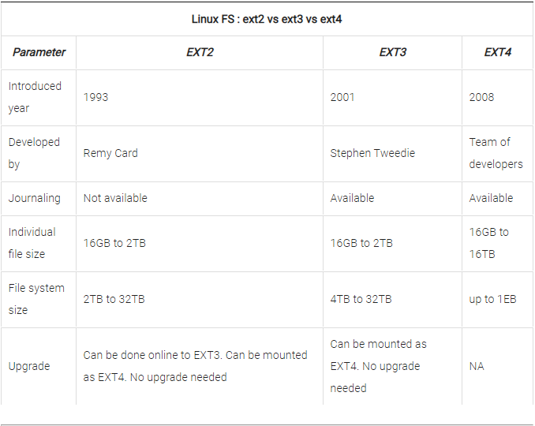
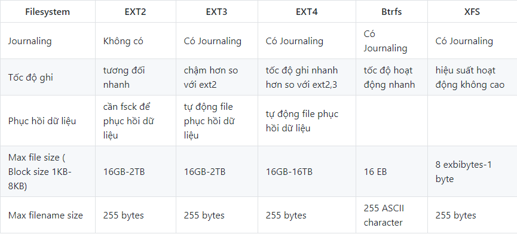
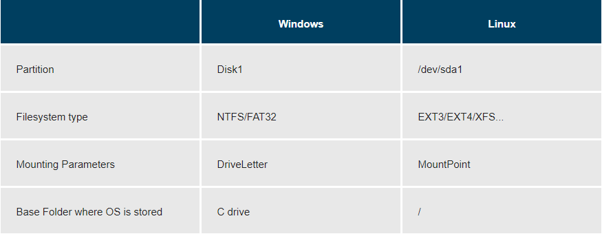
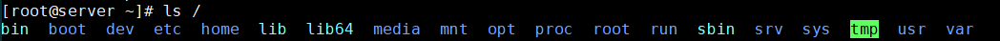
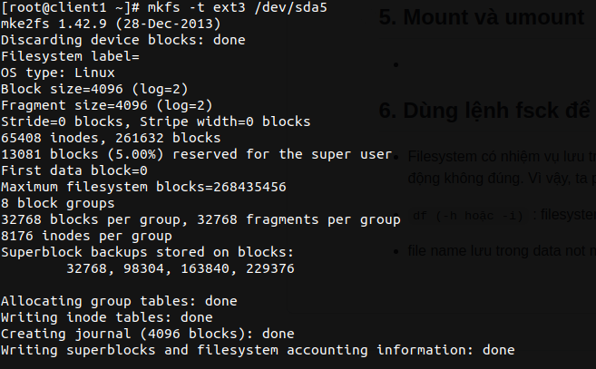
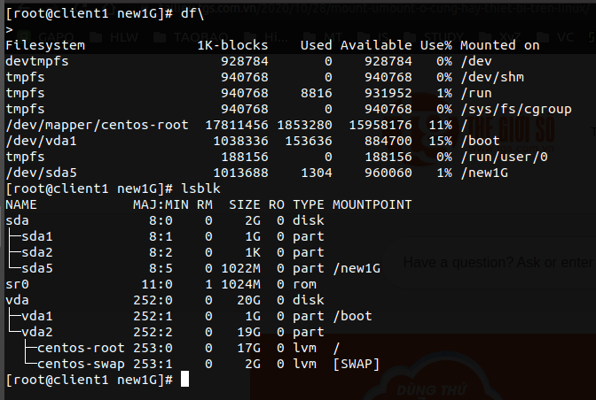

# File System   

## 1. File system
- File system được dùng để quản lý các dữ liệu được đọc và lưu trên thiết bị.

- File system cho phép người dùng truy cập nhanh chóng và an toàn khi cần thiết.

- Các thiết bị lưu trữ như đĩa cứng, usb,..đều có file system, bên dưới là dữ liệu được lưu trữ.  

## 2. Các loại filesystem phổ biến trên Linux

- Các loại filesystem được Linux hỗ trợ:
  - Filesystem cơ bản: EXT2, EXT3, EXT4, XFS, Btrfs, JFS, NTFS,…
  - Filesystem dành cho dạng lưu trữ Flash(thẻ nhớ): ubifs, JFFS2, YAFFS v.v.
  - Filesystem dành cho hệ cơ sở dữ liệu
  - Filesystem mục đích đặc biệt: procfs, sysfs, tmpfs, squashfs, debugfs,…

- Cụ thể:  
  - `ext` - Extended Filesystem  
    - `ext` - phần mở rộng của hệ thống tập tin `minix`. Nó đã được thay thế hoàn toàn bởi phiên bản thứ hai của hệ thống tập tin mở rộng (ext2) và đã bị xóa khỏi kernel.  
    - `ext2` - Hệ thống tệp mở rộng thứ hai được tạo ra để khắc phục các hạn chế của `ext`. Hệ thống tệp Linux đầu tiên cho phép lữu trữ 2TB dữ liệu; phù hợp với thẻ SD và USB vì nó có hiệu suất cao và ghi thấp (vì không có nhật ký).  
    - `ext3` - phiên bản ghi nhật ký của hệ thống tập tin ext2(Ghi nhật ký theo dõi các thay đổi tệp giúp phục hồi nhanh và giảm cơ hội nếu mất dữ liệu trong trường hợp xảy ra sự cố hệ thống). Nâng cấp FS từ ext2 lên ext3 là quy trình trực tuyến không có thời gian chết. 
    - `ext4` - bộ nâng cấp của ext3. Có thêm nhiều tính năng mới:   - Hỗ trợ volume có dung lượng tối đa lên đến 1 exbibyte (1 EiB = 10­30 TB) và file có kích thước 16 tebibyte (1 TiB = 1024 TB)
      - Cải thiện hiệu suất tập tin lớn và chống phân mảnh
      - Không giới hạn thư mục con
      - Kiểm tra toàn vẹn dữ liệu (checksum)
      - Tính toán thời gian chuẩn đến nano giây (1 nano giây = 10-9 giây).  
    Do khả năng tương thích ngược, ext2, ext3 có thể được gắn trực tiếp dưới dạng ext4 nên không cần nâng cấp FS.  

  - `JFS` - Journaled File System: được phát triển bởi IBM AIX UNIX được sử dụng như là một thay thế cho hệ thống tệp ext. Nó được tích hợp sẵn vào Linux trong kernel 2.4.24. JFS là một thay thế cho ext4 hiện tại và được sử dụng khi cần sự ổn định với việc sử dụng rất ít tài nguyên. 

  - `XFS` -  là một JFS tốc độ cao nhằm xử lý I/O song song.  
  - `Btrfs` - (B-tree file system): Btrfs được đưa vào sử dụng chính thức năm 2014. Mục tiêu của nó nhằm giải quyết các vấn đề pooling, snapshot, checksum và tích hợp thiết bị mở rộng trong Linux. Không giống như ext4, Btrfs dựa trên công nghệ hoàn toàn mới và cải tiến hơn: Copy-on-write (COW). Công nghệ này đã giúp Btrfs có những tính năng vượt trội sau:
    - Tự kiểm tra và sửa lỗi cấu trúc của file system  
    - Chống phân mảnh dữ liệu
    - Kiểm tra và khôi phục lỗi của dữ liệu bằng các bản dự phòng.
    - Hỗ trợ cơ chế Cloning (kể cả tập tin)
    - Hỗ trợ subvolume và snapshot (writable hoặc readonly)
    - Hỗ trợ Incremental backup (toàn bộ dữ liệu lẫn thay đổi được backup đều lưu trong 1 task).    

### So Sánh EXT, Btrfs, XFS

  

- [Kiểm tra type linux file system](check_type_file_system.md)  

## 3. Phân vùng và file system  

- Một phân vùng là một vùng chứa trong đó có một filesystem được lưu trữ , trong một số trường hợp thì filesystem có thể mở rộng hơn một phân vùng nếu filesystem sử dụng các liên kết.

- File system là một phương pháp lưu trữ hoặc tìm kiếm các tập tin trên một đĩa cứng ( trong một phân vùng ).

- So sánh giữa filesystem trên hệ điều hành Windows và hệ điều hành Linux:  

  

## 4. Filesystem Hierarchy Standard (FHS)
- Filesystem của hệ điều hành Linux được tổ chức theo tiêu chuẩn cấp bậc của hệ thống tập tin Filesystem Hierarchy Standard (FHS). Tiêu chuẩn này định nghĩa mục đích của mỗi thư mục.

  Hình bên dưới là cấu trúc thư mục trong Linux:  

   

- Linux  sử dụng ký tự `/` để phân tách các đường dẫn (không giống như Windows, sử dụng `\`) và không có ký tự ổ đĩa. Các ổ đĩa mới được gắn dưới dạng thư mục trong hệ thống tệp đơn, thường nằm dưới  `/media`  (ví dụ, đĩa CD-ROM có nhãn FedORA có thể được tìm thấy tại `/media/FedORA` và tệp  `README.txt`  trên đĩa đó sẽ là tại `/media/FEDORA/README.txt`).  
- Tất cả các tên hệ thống tập tin Linux đều phân biệt chữ hoa chữ thường, vì vậy  `/boot`, `/Boot` và  `/BOOT`  là ba thư mục khác nhau. 

   

## TÀI LIỆU THAM KHẢO  
- [w3resource.com](https://www.w3resource.com/linux-system-administration/file-system.php)
- [redhat.com](https://www.redhat.com/sysadmin/navigating-filesystem-linux-terminal)
- [wiki.archlinux.org](https://wiki.archlinux.org/index.php/File_systems)
- [man7.org](http://man7.org/linux/man-pages/man5/filesystems.5.html)
- [poorvavmlinux.blogspot.com](http://poorvavmlinux.blogspot.com/2015/06/file-system-in-linux.html)
- [kerneltalks.com](https://kerneltalks.com/disk-management/difference-between-ext2-ext3-and-ext4/)
- [courses.edx.org](https://courses.edx.org/asset-v1:LinuxFoundationX+LFS101x.2+1T2015+type@asset+block@LFS101_Ch3_Sec1_FSH.pdf)
- https://vnreview.vn/tu-van-may-tinh/-/view_content/content/1715965/phan-biet-cac-dinh-dang-ntfs-fat32-va-exfat
- https://www.lifewire.com/what-is-file-allocation-table-fat-2625877
- http://www.data-recovery-app.com/datarecovery/fat16.html
- https://support.microsoft.com/vi-vn/help/100108/overview-of-fat-hpfs-and-ntfs-file-systems
- http://thuthuat.taimienphi.vn/cach-mount-gan-thiet-bi-luu-tru-tren-linux-terminal-47720n.aspx

# Tạo File system bằng `mkfs`
 - `mkfs` - build linux filesystem
 - Một số option thường dùng : 
 	- `-t` : Chỉ định loại FS ( default = ext2 )
 	- `-c` : Check bad block trước khi tạo file 

- các thuộc tính quan trọng : 
 	- inode : thuộc  meta -  phần ilist, chứa thông tin liên quan thuộc tính. Là 1 con số, đơn vị đo cho phần meta.
 	- superblock : phần các vị trí backup của meta 

# Mount và umount

 -  Sau khi tạo phân vùng mới để lưu data, tạo FS cho nó, bước tiếp theo là ta cần gán nó vào trong hệ thống bằng lệnh `mount`

 - Cú pháp : ` mount [device] [mount point] `

 - Tham chiếu thực tế, device = /dev/sda5 ( partion vừa tạo ) , mount point = /new1G (folder mới mình đã tạo trên cây thư mục ), như vậy, câu lệnh cần thực thi sẽ là : `mount /dev/sda5 /new1G` , cùng chạy lệnh mà xem kết quả.

 - Check nhanh bằng `df` or `lsblk`, ta thấy parition mới /dev/sda5 đã được mount vào cây thư mục, sẵn sàng sử dụng trên hệ thống 

 - Để bỏ gán, ta thực hiện câu lệnh `umount [device]`
 - Ví dụ để bỏ mount /dev/sda5 ở trên, thực hiện lệnh `umount /dev/sda5`

# Dùng lệnh fsck để check và sửa lỗi filesystem

- `Filesystem` có nhiệm vụ lưu trữ và tổ chức dữ liệu của người dùng. 
- Nếu như nó bị hỏng, không hoạt động sẽ gây đến việc hệ thống hoạt động không đúng. Vì vậy, ta phải có một công cụ để kiểm tra và sửa filesystem fcsk ( file system consistency check ).
- cú pháp : fsck [device] - lưu ý cần umont thiết bị ra thì mới check được
Ngoài ra, tính năng fsck này còn được tích hợp trong recovery mode của linux, trường hợp này ta áp dụng khi cần check FS của của /