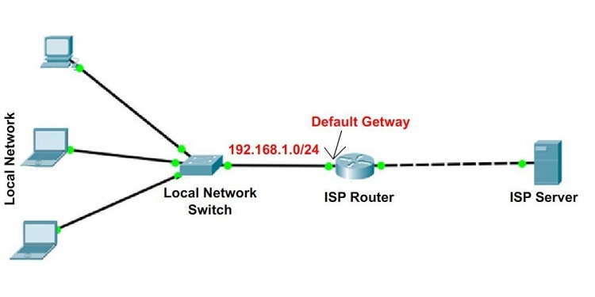
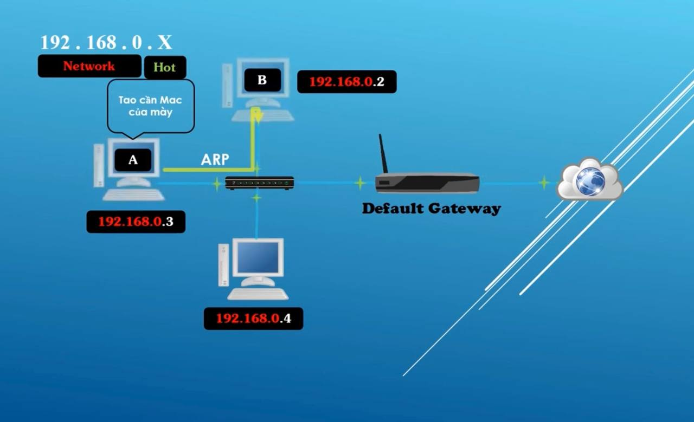

# Default GetWay

## Switch là gì?

Một "switch" là một `thiết bị mạng phục vụ để kết nối các thiết bị mạng khác nhau trong một mạng cục bộ (LAN - Local Area Network)`. Switch hoạt động ở tầng 2 (tầng liên kết dữ liệu) hoặc tầng 2 và tầng 3 (tầng mạng) của mô hình OSI.

Công việc chính của một `switch` là `hướng dẫn gói tin dữ liệu từ một thiết bị mạng nguồn đến thiết bị mạng đích.` Khi gói tin dữ liệu được nhận từ một thiết bị, switch sẽ kiểm tra địa chỉ MAC (địa chỉ vật lý) của gói tin và quyết định xem nó nên được chuyển tiếp đến cổng kết nối nào. Các switch hiện đại thường có khả năng học hỏi các địa chỉ MAC của các thiết bị mạng trong mạng LAN và lưu trữ chúng trong một bảng địa chỉ, điều này giúp chúng tối ưu hóa việc chuyển tiếp dữ liệu.

Một số điểm chính về switch bao gồm:

1. **Chuyển mạch (Switching)**: Switch chuyển gói tin dữ liệu từ một cổng vào cổng khác dựa trên địa chỉ MAC của thiết bị mạng.

2. **Băng thông cao**: Switch thường có khả năng hỗ trợ băng thông cao, cho phép truyền dữ liệu nhanh chóng và hiệu quả trong mạng LAN.

3. **Kết nối nhiều thiết bị**: Switch cho phép kết nối nhiều thiết bị mạng (ví dụ: máy tính, máy chủ, máy in) trong một mạng LAN.

4. **Cải thiện hiệu suất**: Sử dụng switch thay vì hub (một thiết bị mạng cũ hơn) có thể cải thiện hiệu suất mạng bằng cách giảm tiêu tốn băng thông và tăng tốc độ truyền dữ liệu.

5. **Hỗ trợ VLAN**: Một số switch cũng hỗ trợ tính năng VLAN (Virtual Local Area Network) để chia mạng LAN thành các phân đoạn logic khác nhau.

Tóm lại, `switch` là một thành phần chính trong các mạng LAN hiện đại, giúp tạo ra một mạng nhanh chóng, linh hoạt và hiệu quả.

### Công dụng của Switch

- Công dụng chính của switch là tạo ra một mạng nội bộ trong đó các thiết bị như máy tính, máy in, máy chủ, và các thiết bị mạng khác có thể truyền dữ liệu với nhau. Dưới đây là cách một switch hoạt động và cách sử dụng nó:

  - `Chuyển tiếp dữ liệu:` Khi một gói dữ liệu (frame) được nhận từ một cổng, switch sẽ xem địa chỉ MAC (địa chỉ vật lý) của gói tin và quyết định chuyển tiếp gói tin đến cổng phù hợp để gửi đến thiết bị đích. Điều này giúp tránh việc gửi dữ liệu đến tất cả các cổng như trong trường hợp của hub (trong hub, mỗi gói dữ liệu được gửi đến tất cả các cổng, dẫn đến lãng phí băng thông).

  - `Tạo một mạng LAN:` Switch giúp tạo ra một mạng LAN bằng cách kết nối các thiết bị mạng với nhau. Các thiết bị này có thể là máy tính, máy in, điện thoại IP, camera an ninh, vv.

  - `Tăng tốc độ truyền dữ liệu:` Switch có khả năng kết nối nhiều thiết bị mạng với nhau đồng thời và chuyển tiếp dữ liệu tại tốc độ cao, giúp tăng hiệu suất mạng.

  - `Tạo mạng VLAN:` Switch cũng có khả năng phân chia một mạng LAN thành nhiều mạng con ảo (VLAN - Virtual LAN), giúp tăng cường tính bảo mật và quản lý mạng.

Để sử dụng một switch, bạn cần chỉ định các cổng kết nối với các thiết bị mạng và kết nối switch với các thiết bị khác như router hoặc modem để kết nối với mạng bên ngoài. Các thiết bị trong mạng LAN sẽ tự động tìm hiểu và giao tiếp với nhau thông qua switch.

## Subnet Mask là gì?

- `subnet mask` cho biết có bao nhiểu bít trong địa chỉ IP đc sử dụng cho mạng bằng cách che đi phần Network Adress trong đại chỉ IP.

- `Subnet Mask` (hay còn được gọi là mặt nạ mạng) là một phần quan trọng của cấu hình mạng trong môi trường IP. Nó được sử dụng `để xác định phạm vi của một mạng con (subnet) trong một mạng lớn hơn.` 

- Subnet Mask chỉ định địa chỉ IP của một máy tính được chia thành hai phần: phần địa chỉ mạng (network address) và phần địa chỉ máy (host address).

- Subnet Mask thường được biểu diễn dưới dạng dãy các số nhị phân hoặc dạng dấu chấm (dotted-decimal) gồm 4 số từ 0 đến 255, như trong ví dụ: 255.255.255.0. Mỗi số trong subnet mask thể hiện số bit trong phần mạng của địa chỉ IP. 

- Đây là một số ví dụ:

  - Subnet Mask 255.255.255.0 tương ứng với 24 bit được sử dụng cho phần mạng và 8 bit được sử dụng cho phần máy.
  - Subnet Mask 255.255.255.128 tương ứng với 25 bit cho phần mạng và 7 bit cho phần máy.

## Dùng làm gì?

subnetmask dùng để `phân biệt` đại chỉ ip phần nào là `network address` và phần nào là `Host address`, từ đó `hỗ trợ` trong việc `định cấu hình, định tuyến và bảo mật trong mạng máy tính.`

### Cách sử dụng Subnet Mask:

1. **Xác định phạm vi của mạng con (subnet)**: Bằng cách kết hợp Subnet Mask với địa chỉ IP, bạn có thể xác định được phạm vi của mạng con. Cụ thể, các bit trong địa chỉ IP mà tương ứng với các bit 1 trong Subnet Mask sẽ xác định địa chỉ mạng con.

2. **Phân biệt giữa phần mạng và phần máy trong địa chỉ IP**: Subnet Mask giúp phân biệt đâu là phần mạng và đâu là phần máy trong địa chỉ IP. Điều này quan trọng để định tuyến dữ liệu trong mạng.

3. **Cấu hình và quản lý mạng**: Subnet Mask là một phần quan trọng trong quá trình cấu hình và quản lý mạng, giúp xác định các mạng con và địa chỉ IP cho các thiết bị trong mạng LAN hoặc WAN.

## Default GetWay là gì?

- `Default GetWay`: là 1 thiết bị `chuyển tiếp từ mạng này sang mạng khác` 
-> Router

- Default GetWay cho phép các thiết bị từ 1 mạng này giao tiếp được với các thiết bị trên mạng khác. và nó thường đc gọi là `Router`

### Công dụng của Default Gateway trong mạng máy tính:

Định tuyến gói tin: Khi một thiết bị trong mạng muốn gửi dữ liệu đến một địa chỉ ngoài mạng nội bộ, nó sẽ gửi gói tin đến Default Gateway. Default Gateway sẽ biết cách định tuyến gói tin đến mạng bên ngoài hoặc mạng đích cụ thể.

Truy cập Internet: Default Gateway thường được cấu hình để truy cập Internet thông qua một kết nối WAN như DSL, cáp, hoặc dây nối quang. Khi bạn truy cập các trang web hoặc dịch vụ trên Internet từ mạng nội bộ của bạn, dữ liệu của bạn được chuyển tiếp qua Default Gateway để đến mạng Internet.

### Cách sử dụng Default Gateway:

Mặc định, hệ thống của bạn sẽ được cấu hình để sử dụng một Default Gateway. Điều này thường được cấu hình tự động thông qua DHCP (Dynamic Host Configuration Protocol) khi bạn kết nối vào mạng.
Nếu bạn cần cấu hình Default Gateway thủ công, bạn có thể thực hiện thông qua cài đặt mạng trên hệ điều hành của bạn. Đối với hệ điều hành Linux hoặc Unix-like, bạn có thể sử dụng các lệnh như route hoặc ip route để thêm hoặc chỉnh sửa Default Gateway.
Trong một mạng doanh nghiệp, việc cấu hình Default Gateway thường được thực hiện trên router hoặc thiết bị mạng chuyên dụng, và người quản trị mạng sẽ quản lý và cấu hình nó.

# Arp  là gì

- Giao thức ARP (Address Resolution Protocol) được triển khai và quản lý bởi hệ điều hành để giải quyết các ánh xạ giữa địa chỉ IP và địa chỉ MAC trên mạng. 
- Dưới đây là một số cách mà Linux sử dụng ARP:

**1. ARP Cache:** Linux duy trì một bảng ARP cache để lưu trữ các ánh xạ giữa địa chỉ IP và địa chỉ MAC mà nó đã học được từ các giao tiếp mạng trước đó. Bảng ARP cache có thể được xem và quản lý bằng cách sử dụng lệnh arp hoặc ip neigh.

*Ví dụ:*

    arp -n
    ip neigh show

**2.Gửi ARP Requests và Xử lý ARP Replies:** Khi một thiết bị Linux cần gửi dữ liệu đến một địa chỉ IP, nhưng không biết địa chỉ MAC của thiết bị đó, nó sẽ gửi một ARP Request và chờ nhận ARP Reply từ thiết bị đích. Linux tự động quản lý việc gửi ARP Requests và xử lý ARP Replies.

**3.Cấu hình ARP:** Bạn có thể cấu hình các tham số liên quan đến ARP trên Linux, bao gồm thời gian sống (time to live) của các mục trong bảng ARP cache, hoặc vô hiệu hóa việc sử dụng ARP.

*Ví dụ:*

    sysctl -w net.ipv4.neigh.default.gc_stale_time=3600
    sysctl -w net.ipv4.neigh.default.gc_thresh1=4096

Để thực hiện các thay đổi cấu hình ARP này một cách lâu dài, bạn có thể chỉnh sửa tệp /etc/sysctl.conf.

**4.ARP Proxy:** Linux cũng hỗ trợ chức năng ARP Proxy, cho phép nó chuyển tiếp các gói tin ARP giữa các mạng khác nhau. Điều này hữu ích trong một số tình huống cụ thể khi cần liên kết các mạng khác nhau với nhau.

Các hoạt động ARP trên Linux được tự động thực hiện bởi hệ thống và không cần sự can thiệp của người dùng đối với hầu hết các tình huống thông thường. Tuy nhiên, bạn vẫn có thể sử dụng các công cụ và lệnh cấu hình để kiểm soát và quản lý ARP trên hệ thống của mình.

### Cách hoạt động của ARP như sau:

1. ARP Cache: Linux duy trì một bảng ARP cache để lưu trữ các ánh xạ giữa địa chỉ IP và địa chỉ MAC của các thiết bị trong mạng cục bộ. Khi một thiết bị Linux gửi gói tin đến một địa chỉ IP nào đó, trước tiên nó sẽ kiểm tra trong bảng ARP cache xem nó đã biết địa chỉ MAC tương ứng chưa. Nếu đã biết, nó sẽ sử dụng địa chỉ MAC từ bảng ARP cache, nếu không, nó sẽ thực hiện các bước tiếp theo.

2. ARP Request: Nếu địa chỉ MAC tương ứng với địa chỉ IP không tồn tại trong bảng ARP cache, thiết bị Linux sẽ gửi một ARP Request ra mạng LAN. ARP Request chứa địa chỉ IP của thiết bị mà nó muốn liên lạc.

3. ARP Reply: Thiết bị mạng mà có địa chỉ IP được yêu cầu sẽ nhận được ARP Request và gửi một ARP Reply trả lời lại. ARP Reply chứa địa chỉ MAC của thiết bị đó. Thông tin này sẽ được thiết bị Linux lưu vào bảng ARP cache cho lần truy cập tiếp theo.

4. Cập nhật bảng ARP cache: Sau khi nhận được ARP Reply, thiết bị Linux sẽ cập nhật bảng ARP cache của nó với thông tin mới nhận được, bao gồm cả ánh xạ giữa địa chỉ IP và địa chỉ MAC của thiết bị đích.

5. Sử dụng thông tin từ bảng ARP cache: Sau khi bảng ARP cache được cập nhật, thiết bị Linux sẽ sử dụng thông tin này để gửi dữ liệu trực tiếp đến địa chỉ MAC của thiết bị đích mà không cần gửi thêm ARP Request.

### Quá trình hoạt động của ARP như sau:

1. Gửi ARP Request: Khi một thiết bị Linux cần gửi dữ liệu đến một địa chỉ IP trên mạng nội bộ mà nó không biết địa chỉ MAC tương ứng, nó sẽ gửi một ARP Request ra mạng. ARP Request này chứa địa chỉ IP của thiết bị mà nó muốn liên lạc.

2. Xử lý ARP Reply: Thiết bị mục tiêu có địa chỉ IP mà được yêu cầu sẽ nhận được ARP Request và gửi lại một ARP Reply chứa địa chỉ MAC của nó cho thiết bị gửi. Khi Linux nhận được ARP Reply, nó sẽ cập nhật bảng ARP cache của mình với thông tin này.

3. Duy trì bảng ARP cache: Bảng ARP cache của Linux chứa các mục mà nó đã học được từ các giao tiếp mạng trước đó. Thông tin trong bảng ARP cache giúp Linux xác định địa chỉ MAC của các thiết bị mạng khác trong cùng một mạng nội bộ.

4. Sử dụng ARP cache: Khi một thiết bị cần gửi dữ liệu đến một địa chỉ IP mà nó đã giao tiếp trước đó, nó sẽ kiểm tra bảng ARP cache để xem liệu nó đã biết địa chỉ MAC của thiết bị đó hay chưa. Nếu có, nó sẽ sử dụng thông tin từ bảng ARP cache mà không cần gửi ARP Request.

5. Giao tiếp với ARP Daemon (arpd): Trong một số trường hợp, Linux cũng có thể sử dụng một tiến trình gọi là ARP Daemon để quản lý và cập nhật bảng ARP cache. ARP Daemon thường được sử dụng trong các mạng lớn hoặc trong môi trường đòi hỏi hiệu suất cao hơn trong việc giải quyết địa chỉ MAC.

# Địa chỉ Mac trong linux

`MAC address` (địa chỉ MAC), còn được gọi là "hardware address" (địa chỉ phần cứng). Địa chỉ MAC là một địa chỉ duy nhất gắn với mỗi card mạng Ethernet và được sử dụng để xác định và phân biệt các thiết bị mạng khác nhau trên cùng một mạng LAN.

`MAC address` là một chuỗi 48 bit (6 byte) và thường được biểu diễn dưới dạng dạng thập lục phân (hexadecimal) và phân cách bằng dấu hai chấm (:), ví dụ: 00:1A:2B:3C:4D:5E. Mỗi card mạng Ethernet trên một thiết bị sẽ có một `MAC address` duy nhất, được ghi vào ROM trong card mạng và không thể thay đổi.

Trong Linux, bạn có thể sử dụng các công cụ như ifconfig, ip, hoặc ethtool để xem `MAC address` của các card mạng trên hệ thống. 

Ví dụ, để xem thông tin chi tiết về các card mạng trên hệ thống của bạn, bao gồm `MAC address`, bạn có thể sử dụng lệnh ip:

    ip link show

Kết quả sẽ hiển thị danh sách các card mạng trên hệ thống của bạn cùng với thông tin chi tiết về mỗi card, bao gồm MAC address của chúng.

MAC address quan trọng trong quá trình giao tiếp trên mạng Ethernet, vì nó được sử dụng để xác định nguồn và đích của các gói dữ liệu trong mạng LAN.

Nếu cùng dải mạng `máy tính a` muốn giao tiếp với `máy tính b` thì cần thông qua `MAC address`, muốn lấy đc `MAC address` máy tính a `dùng chương trình phát sóng arp` yêu cầu `máy tính b gửi MAC address cho mình.` Khi có `MAC address` thì giao tiếp mới được diễn ra.
