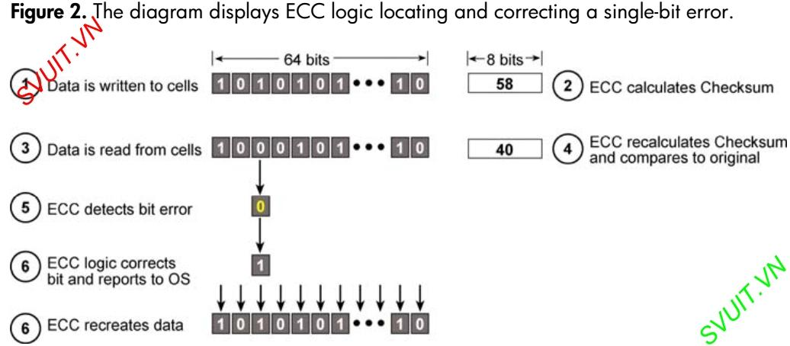
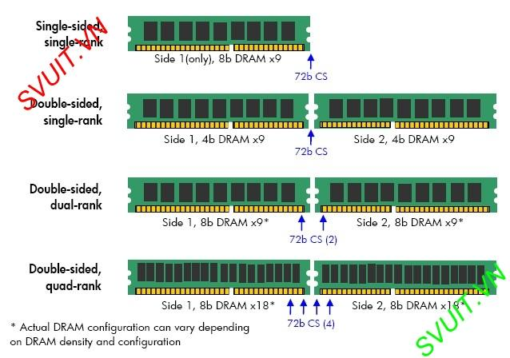
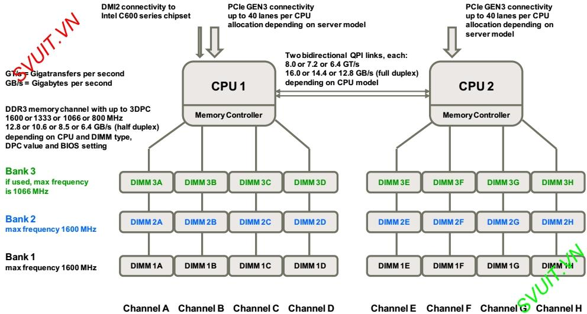

# Ram ecc là gì?

- RAM ECC (Error-Correcting Code) là một dạng của bộ nhớ RAM được thiết kế để phát hiện và sửa lỗi dữ liệu trong quá trình lưu trữ và truy xuất. Cụ thể, ECC sử dụng các mã kiểm tra để phát hiện lỗi dữ liệu và các mã sửa lỗi để sửa chữa lỗi nếu có.

- Các loại RAM ECC thường được sử dụng trong các hệ thống yêu cầu tính ổn định và độ tin cậy cao, như máy chủ, trung tâm dữ liệu, máy trạm, và các hệ thống yêu cầu khả năng chịu lỗi cao.

    **Ưu điểm của RAM ECC bao gồm:***

    - Tăng độ tin cậy: Bằng cách phát hiện và sửa lỗi dữ liệu, RAM ECC giúp ngăn chặn sự hỏng hóc và giảm nguy cơ mất dữ liệu.

    - Giảm downtime: Bằng cách sửa lỗi dữ liệu một cách tự động, RAM ECC giúp giảm thiểu thời gian dừng và downtime của hệ thống.

    - Phù hợp cho các ứng dụng yêu cầu độ tin cậy cao: RAM ECC thường được sử dụng trong các môi trường nơi độ tin cậy và tính ổn định là ưu tiên hàng đầu.

    Tuy nhiên, RAM ECC thường có giá cả đắt hơn so với RAM không có ECC và yêu cầu hỗ trợ từ phần cứng và phần mềm của hệ thống để hoạt động hiệu quả.

# RAM ECC hoạt động như thế nào

- RAM ECC có `9 chip` thay vì 8 chip so với RAM không có tính năng ECC.

- Khả năng `tự kiểm tra và sửa lỗi cho từng bit riêng lẻ giúp nó phát hiện và sửa lỗi kịp thời ngay lúc xảy ra`. Cơ chế hoạt động của ECC không giống như RAID 4 và 5 (sử dụng `thuật toán XOR` để tạo ra parity bit).

  - ECC sẽ không hy sinh một phần bộ nhớ để sử dụng cho việc sửa lỗi mà có xu hướng `bổ sung thêm chip vào bộ nhớ ECC.`

  - **Nhược điểm** của ECC là chỉ có cơ chế sửa lỗi trên từng bit riêng lẻ nên khi có `nhiều bit lỗi xảy ra cùng 1 lúc` thì bộ nhớ ECC tuy phát hiện ra lỗi nhưng `không có khả năng sửa kịp.`

  - Đối với máy tính bàn, laptop hay thiết bị di động thì chức năng sửa lỗi ECC ít được quan tâm hơn, khi bị sẽ gây ra lỗi chương trình hoặc buộc phải khởi động lại máy gây ra phiền phức.

  - Tuy nhiên đối với máy chủ, việc duy trì tính toàn vẹn của dữ liệu và khả năng hoạt động liên tục là 2 ưu tiên hàng đầu, do đó lựa chọn RAM ECC cho máy chủ gần như trở thành tiêu chuẩn, hết sức quan trọng.

## Cơ chế hoạt động:

- ECC `mã hóa thông tin` trong một khối 8 bits `cho phép phục hội lại lỗi bit đơn.`

- Mỗi lần dữ liệu được ghi vào bộ nhớ, ECC sử dụng một thuật toán đặc biệt để tạo ra các giá trị được gọi là check bits. Các thuật toán thêm những check bít cùng với nhau để tính toán ra giá trị checksum, sau đó checksum sẽ được lưu trữ cùng với dữ liệu.

- Khi dữ liệu đọc từ bộ nhớ, các thuật toán sẽ tính toán lại giá trị checksum và so sánh với checksum đã thêm vào dữ liệu lúc trước. Nếu giá trị checksum giống nhau thì đữ liệu đó hợp lệ và tiếp tục hoạt động.

- Nếu giá trị checksum khác nhau, dữ liệu có lỗi và bộ nhớ ECC logic sẽ cô lập các lỗi và báo cáo với hệ thống. Trong trường hợp lỗi đơn bit, bộ nhớ ECC logic có thể sữa lỗi và xuất ra dữ liệu được sửa để hệ thống tiếp tục vận hành.

- Công nghệ ECC cung cấp bảo vệ đầy đủ cho nhiều ứng dụng. Tuy nhiên, hiệu quả của ECC bị giảm khi dung lượng bộ nhớ tăng. Thực tế những máy chủ công nghiệp ngày càng hỗ trợ dung lượng bộ nhớ lớn hơn bởi vì những nhân tố sau:
  - Hệ điều hành bây giờ hỗ trợ dung lớn bộ nhớ lớn hơn rất nhiều.
  - Chi phí thấp, bộ nhớ dung lớn sẵn sàng hơn
  - Hỗ trợ máy chủ ảo.

## Sự khác nhau giữa RAM Registered ECC và RAM Unbuffered ECC?
- Hiện nay, hầu hết loại bộ nhớ sử dụng trong máy tính để bàn, laptop, thiết bị di động là loại không sử dụng bộ nhớ đệm và không có khả năng tự kiểm tra và sửa lỗi Non-ECC (Non-Error Checking and Correction). 
- Việc hỗ trợ loại bộ nhớ ECC UDIMM (ECC Unbuffered) hay ECC RDIMM (ECC Registered) là do loại CPU của Intel hoặc AMD quyết định.

- Vậy thực chất sự khác biệt giữa 2 loại RAM Registered ECC và RAM Unbuffered ECC là gì? Trước hết giữa RDIMM và UDIMM đã có sự khác nhau.
  - `RDIMM` là bộ nhớ có `chứa các thanh ghi (register)`
  - `UDIMM` là bộ nhớ `không có các bộ đệm hoặc thanh ghi (register)` mà các `thiết bị được thiết kế trên bo mạch chủ.`
- Chính vì sự khác biệt đó nên dẫn đến `sự khác nhau căn bản giữa RAM Registered ECC và RAM Unbuffered ECC` là ở `lệnh truy xuất.`
  - `RAM Unbuffered ECC` thì các lệnh truy xuất bộ nhớ được đưa trực tiếp đến module bộ nhớ.
# RAM Registered

Cơ chế hoạt động của RAM Registered ECC có cả ưu và nhược điểm

**Ưu điểm:**
  - `RAM Registered ECC` sẽ giúp `giảm tải bớt khối lượng điều khiển bộ nhớ của CPU, `một phần công việc truy xuất trực tiếp bộ nhớ đã có Register chip thực hiện.
  - Nhờ đó `CPU sẽ bớt được khối lượng công việc, giúp máy chạy tốt và hiệu quả hơn.`
  - Điều này trở nên đặc biệt quan trọng trong môi trường máy chủ.

**Nhược điểm:**
  - Do nguyên lý hoạt động của `RAM Registered ECC` nên các lệnh truy xuất phải gửi đến Register chip trước sau đó mới truyền đến module bộ nhớ. Điều này làm các lệnh chỉ thị sẽ mất xấp xỉ 1 chu kì CPU.
- Đối với môi trường ảo hóa, nơi mà dung lượng bộ nhớ và băng thông bộ nhớ (Memory bandwidth) là các yếu tố then chốt để đạt được mật độ ảo hóa cao, RAM Registered ECC là lựa chọn tốt hơn.
- Nếu bạn đã mua loại RAM Unbuffered ECC rồi sau đó muốn nâng cấp, rất có thể bạn sẽ phải thay thế toàn bộ RAM cũ bằng loại RAM mới và làm tăng chi phí khá nhiều.

# Chipkill, SDDC, DDDC, rank spare, memory miorroing

## Những công nghệ sửa lỗi nâng cao
- Mỗi CPU cung cấp 8 slot cho DDR3 trong 2 bank và 4 channel.
- Nếu bạn cần hơn 8 slot bạn phải cấu hình CPU thứ 2
- Các thanh RAM được hỗ trợ: UDIMM, RDIMM và LRDIMM

## SDDC - Single Device Data Correction 

- `SDDC`, viết tắt của "Single Device Data Correction", là một kỹ thuật `sửa lỗi dữ liệu trên một thiết bị đơn lẻ trong hệ thống lưu trữ hoặc bộ nhớ`. Khi dữ liệu bị hỏng do lỗi phần cứng trên một thiết bị, `SDDC` cho phép thiết bị đó `tự động phát hiện và sửa chữa lỗi` mà không cần can thiệp từ hệ thống hoặc người dùng.

- `SDDC` hoạt động bằng cách sử dụng các mã sửa lỗi được tính toán trước (ví dụ như mã sửa lỗi Hamming) để phát hiện và sửa chữa lỗi dữ liệu. `Khi một lỗi được phát hiện, SDDC sẽ sử dụng thông tin từ các bit dự phòng để khôi phục lại dữ liệu gốc mà không cần phải yêu cầu dữ liệu từ nguồn bên ngoài.` Điều này giúp `tăng cường độ tin cậy và tính khả dụng của hệ thống lưu trữ hoặc bộ nhớ.`

- `Chipkill` được thiết kế để `đảm bảo độ ổn định` cho hệ thống thống. Chipkill còn được gọi với những cái tên khác như `Advanced ECC`, viết tắt cho các tính năng trong module bộ nhớ ECCC và SDDC (Single Device Data Correction / Intel).

  - Đây là những Module bộ nhớ ECC đặc biệt với công nghệ được sử dụng sửa lỗi bổ sung lên đến 4 bit và 8 bit phát hiện lỗi.

- Các hệ thống Sun Microsystems gọi tính năng này là Extended ECC, HP gọi là Chipspare và Intel gọi là SDDC.

- Cơ chế hoạt động của Advanced:
  - `Advanced ECC` có thể `sửa lỗi đa bit trong một chip DRAM`. Vì vậy, nó hoàn toàn có thể sửa lỗi của DRAM Chip.

  - Trong Advanced ECC với 4-bit bộ nhớ, mỗi chip đóng góp 4-bit dữ liệu. 4-bit từ mỗi chip được phân phối cho 4 thiết bị ECC (1 bit trên 1 thiết bị ECC). Vì vậy, một lỗi trong một chip có thể tạo ra 4 lỗi đơn bit riêng rẽ.